# The Python Environment

## OS Basics

Your program runs on an OS e.g. macOS, Windows, Linux. As a developer, you need to be
able to perform basic operations in the OS GUI and at the command prompt:
  - Open a command prompt
  - DIR, CD, MKDIR, CP, DEL (different in linux, macOS)
  - Basic text editor (like notepad and vi)
  - Launch a python program (with command line arguments)
  - Launch IDE (like PyCharm) and find created files in the OS

Other useful skills:
  - StackOverflow (nearly all web searches point here)
  - SSH e.g. putty (for remote development -- raspberry pi)
  - WinSCP (to copy files back and forth)
  - Github (source control -- integrates with IDE)
  - Checking/configuring reserved DHCP addresses on your home router (for raspberry pi)

## Python Interactive

The REPL (Read, Evaluate, Print, Loop) is a great place for testing code snippets and
debugging what's going on.

Windows uses a launcher that makes it easy to install several versions of python.

```
C:\UAH>py --help
Python Launcher for Windows Version 3.8.1150.1013
  ... long spew removed ...

C:\UAH>py
Python 3.8.1 (tags/v3.8.1:1b293b6, Dec 18 2019, 22:39:24) [MSC v.1916 32 bit (Intel)] on win32
Type "help", "copyright", "credits" or "license" for more information.
>>> quit()

C:\UAH>putty 192.168.1.140
pi@CLOCK:~ $ python
Python 2.7.16 (default, Oct 10 2019, 22:02:15)
[GCC 8.3.0] on linux2
Type "help", "copyright", "credits" or "license" for more information.
>>> quit()

pi@CLOCK:~ $ python3
Python 3.7.3 (default, Apr  3 2019, 05:39:12)
[GCC 8.2.0] on linux
Type "help", "copyright", "credits" or "license" for more information.

>>> quit()
```

IMPORTANT: quit() or Ctrl-Z + Return

IMPORTANT: Ctrl-C (SIGINT) and Ctrl+Break (SIGBREAK) (windows)

Nice little features are added to the releases of python.

https://docs.python.org/release/3.8.2/whatsnew/index.html

I'll show you some of the new features, but anything on or after 3.5 should be fine. If something doesn't work
for you, let me know.

On my raspberry pi IoT clock in the living room. Note "python" gets you python2 by default!

Python2 or python3? Largely the same. Easy to modify python2 code to run on python3. Python2 is EOL, but still
being used in legacy.

https://docs.python.org/3/library/2to3.html

The "print" is the most common required change. In P3, "print" is a regular function.

```
C:\UAH>
C:\UAH>py
Python 3.8.1 (tags/v3.8.1:1b293b6, Dec 18 2019, 22:39:24) [MSC v.1916 32 bit (Intel)] on win32
Type "help", "copyright", "credits" or "license" for more information.

>>> asdf
Traceback (most recent call last):
  File "<stdin>", line 1, in <module>
NameError: name 'asdf' is not defined

>>> asdf = 5
>>> asdf
5
>>> b = None
>>> b
>>>
```

The REPL prints the "last thing" unless that is None (null pointer).

```
>>> print "Hello"
  File "<stdin>", line 1
    print "Hello"
                ^
SyntaxError: Missing parentheses in call to 'print'. Did you mean print("Hello")?
>>>
```

In python2 you didn't need the parens. The interpreter is being helpful.


```
>>> print("Hello")
Hello
>>>
```
Call a function, pass arguments, get a return value. All functions always return
something. If you don't say, you get None".

```
>>> print
<built-in function print>
```

Using the function name gets you a pointer to the function instead of calling the function.

```
>>> a = print
>>> a("Hello")
Hello
>>>
```

Print returns None. Which is why the REPL doesn't print "the last thing". You can prove that.
The REPL makes it easy to test theories. Train yourself to tinker!

```
>>> a = print("Hello")
Hello
>>> a
>>>
```

Computers are good with math. In fact, the CPU works extensively with numbers (characters are mapped to numbers).

```
>>> a = 5 + 2
>>> print(a)
7

>>> 5 + 2
7

>>> None
>>> a
7

>>> quit
Use quit() or Ctrl-Z plus Return to exit

>>> exit
Use quit() or Ctrl-Z plus Return to exit

>>> quit()
```

Nice help system built in. HTML docs are easier to use, but the help system is quick in the REPL.

```
>>> help
Type help() for interactive help, or help(object) for help about object.

>>> help(print)
Help on built-in function print in module builtins:

print(...)
    print(value, ..., sep=' ', end='\n', file=sys.stdout, flush=False)

    Prints the values to a stream, or to sys.stdout by default.
    Optional keyword arguments:
    file:  a file-like object (stream); defaults to the current sys.stdout.
    sep:   string inserted between values, default a space.
    end:   string appended after the last value, default a newline.
    flush: whether to forcibly flush the stream.

>>> help()

Welcome to Python 3.7's help utility!

If this is your first time using Python, you should definitely check out
the tutorial on the Internet at https://docs.python.org/3.7/tutorial/.

Enter the name of any module, keyword, or topic to get help on writing
Python programs and using Python modules.  To quit this help utility and
return to the interpreter, just type "quit".

To get a list of available modules, keywords, symbols, or topics, type
"modules", "keywords", "symbols", or "topics".  Each module also comes
with a one-line summary of what it does; to list the modules whose name
or summary contain a given string such as "spam", type "modules spam".

help> quit()
No Python documentation found for 'quit()'.
Use help() to get the interactive help utility.
Use help(str) for help on the str class.

help> quit

You are now leaving help and returning to the Python interpreter.
If you want to ask for help on a particular object directly from the
interpreter, you can type "help(object)".  Executing "help('string')"
has the same effect as typing a particular string at the help> prompt.
>>>
```

## Scripts

When you leave the interpreter, everything you typed is gone. You can put commands in a text file
and then "run" that file over and over.

Use notepad to make "test.py"

```
print("Hello")
print("World")
a = 5 + 2
print(a)
```

Then

```
py test.py
```

You can copy this and email to a friend and edit it and re-run it. This is called programming!

## Is python compiled?

Yes! It is compiled into byte-codes just before the code runs. It uses a virtual machine, conceptually
similar to Java. Except Java is compiled in a separate step.

Python stores the byte codes in a PYC file. You can ship the files to customers instead of your text source.

You'll see them in "__pycache__" directories. Python doesn't always generate them. You can force it to:

```
C:\UAH>py -m py_compile test.py

C:\UAH>dir
 Volume in drive C is OS
 Volume Serial Number is 6AB4-9A76

 Directory of C:\UAH

05/03/2020  04:59 PM    <DIR>          .
05/03/2020  04:59 PM    <DIR>          ..
05/03/2020  04:50 PM                24 test.py
05/03/2020  04:59 PM    <DIR>          __pycache__

C:\UAH>cd __pycache__

C:\UAH\__pycache__>dir
05/03/2020  04:59 PM               121 test.cpython-38.pyc
```

## Disassembly


In case you ever want to see the opcodes:

```
>>> def my_function():
...
KeyboardInterrupt
>>> def my_fun(a,b):
...   if a<5 and b==2:
...     print('YES')
...   else:
...     print('NO')
...
>>> my_fun(1,2)
YES
>>>
>>>
>>> import dis
>>> dis.dis(my_fun)
  2           0 LOAD_FAST                0 (a)
              2 LOAD_CONST               1 (5)
              4 COMPARE_OP               0 (<)
              6 POP_JUMP_IF_FALSE       26
              8 LOAD_FAST                1 (b)
             10 LOAD_CONST               2 (2)
             12 COMPARE_OP               2 (==)
             14 POP_JUMP_IF_FALSE       26

  3          16 LOAD_GLOBAL              0 (print)
             18 LOAD_CONST               3 ('YES')
             20 CALL_FUNCTION            1
             22 POP_TOP
             24 JUMP_FORWARD             8 (to 34)

  5     >>   26 LOAD_GLOBAL              0 (print)
             28 LOAD_CONST               4 ('NO')
             30 CALL_FUNCTION            1
             32 POP_TOP
        >>   34 LOAD_CONST               0 (None)
             36 RETURN_VALUE
```

## PyCharm

Pycharm is an IDE. Lets you edit/run/browse all in one place. Editor makes the code easier to understand. Shows
errors right inline.

Use your favorite if you have one! I use Eclipse in my day to day because that's what I "grew up with". Heck, use
notepad if you like! Notepad++ is another option. So is IDLE that comes with python.

```
py -m idlelib <name of script>
```

PyCharm is popular and easy. I use it for with our highschool robotics code.

First time you launch you'll have limited options

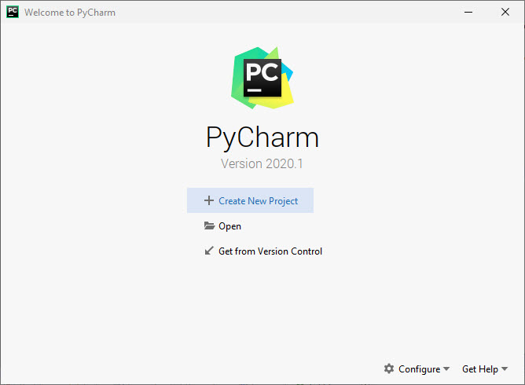

### Creating a new project

The default setting is to create a virtual environment -- a sandbox -- to control versions of libraries.
We don't need the extra complexity now. Pick Existing interprerter and click the "...".

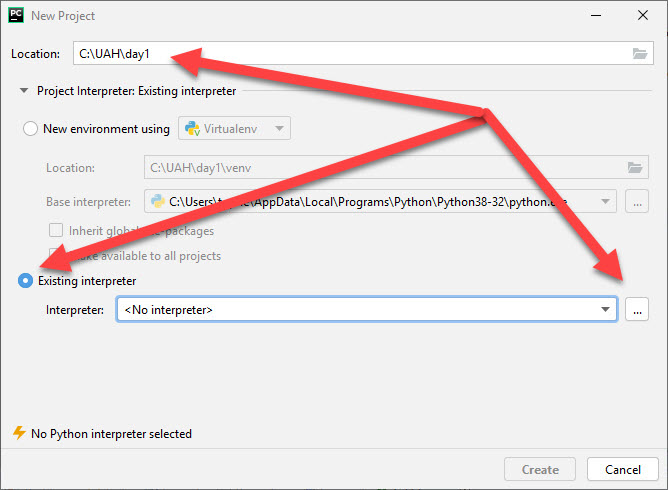

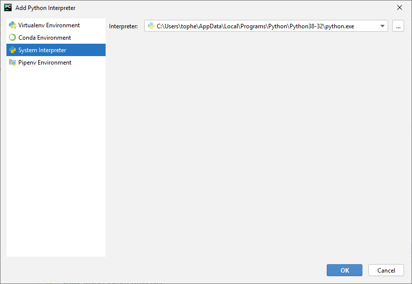

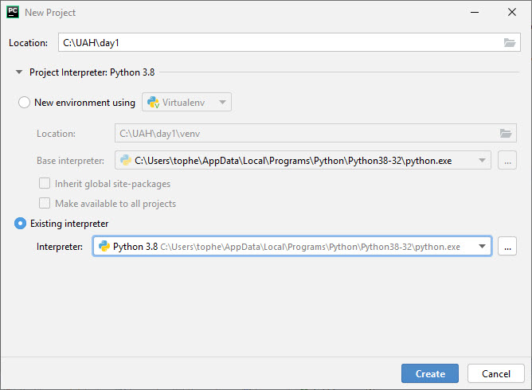

### Adding a new file to a project

Right click on the project and pick New->Python File. Ignore the "Scratch" option.

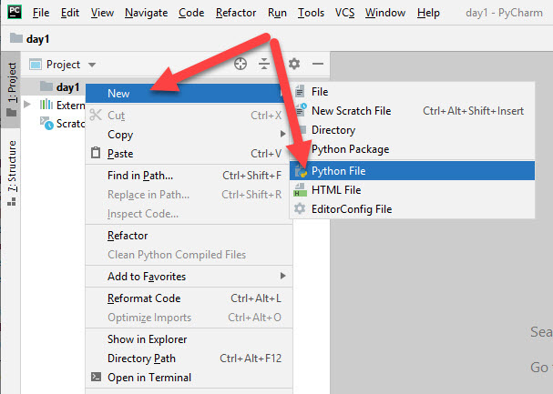

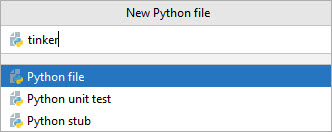

Add some print statements.

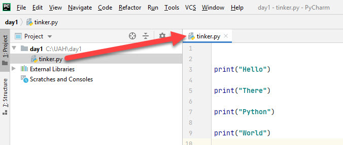

### Running a file

Lots of ways to run code. I like this one: Right click on the file and pick Run. You'll see the output at the bottom.

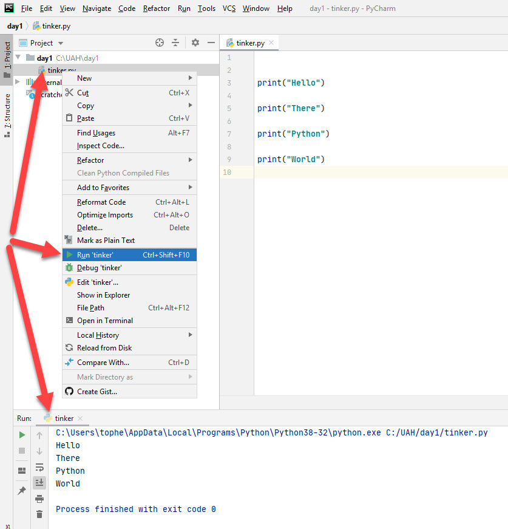

### Debugging a file

Add a breakpoint to one or more of the lines. Right click and pick debug.

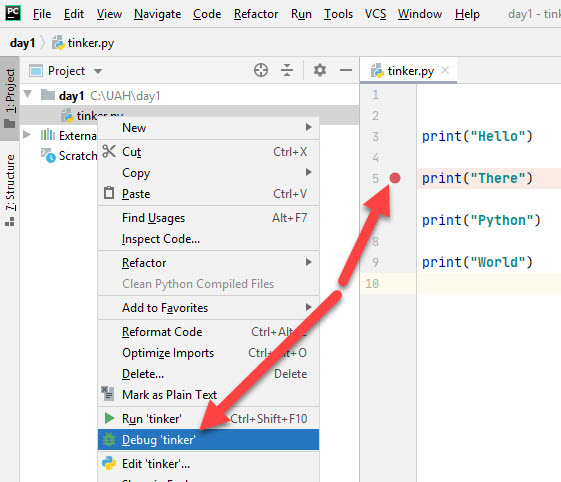

The program runs until it hits a break point. Then it pauses for you to view/change memory.

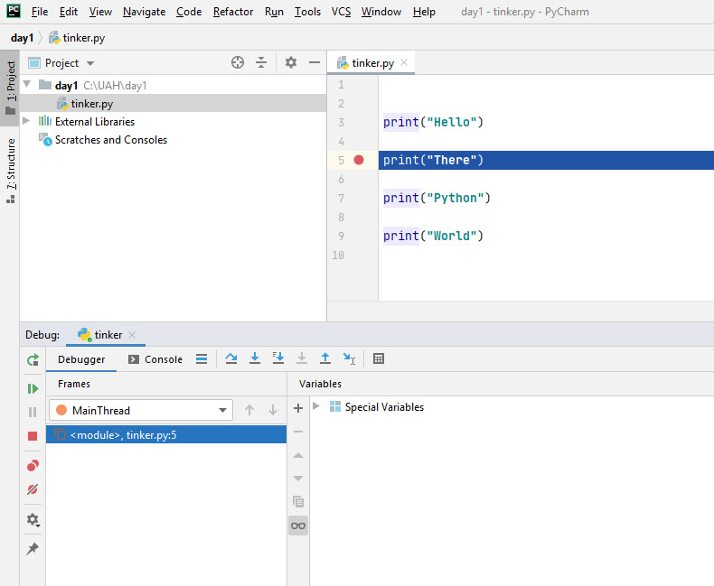

Explore all the little tabs and features at the bottom.

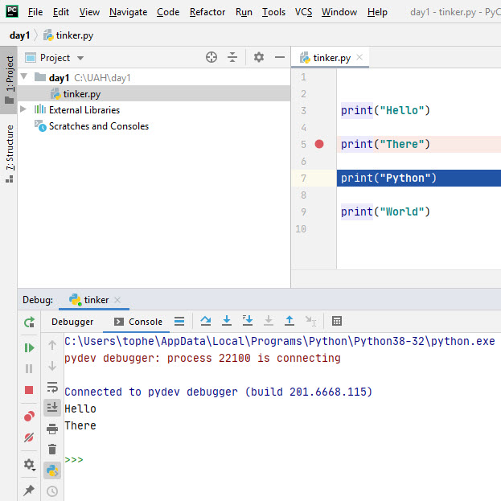

Interact with the REPL ... right inside your running program.

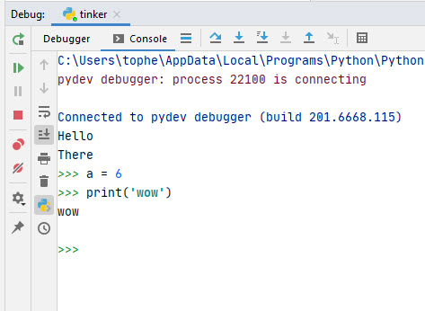

View variables

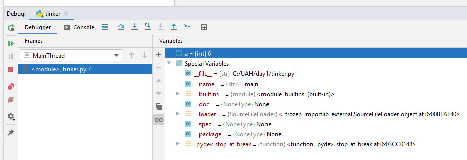

### TODOs

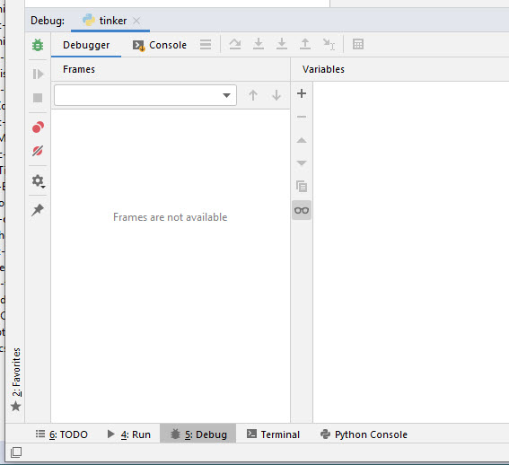

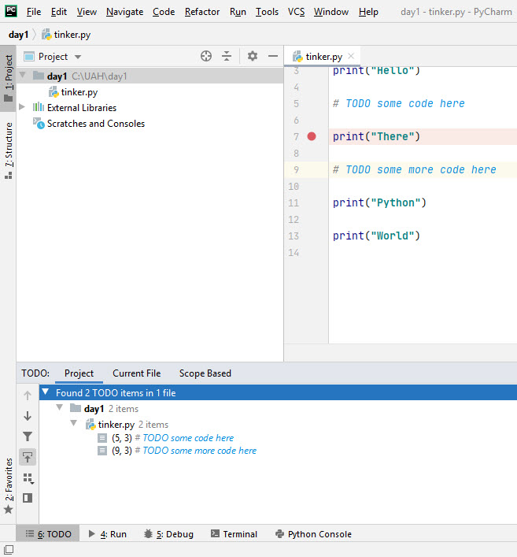

### Finding files on the filesystem

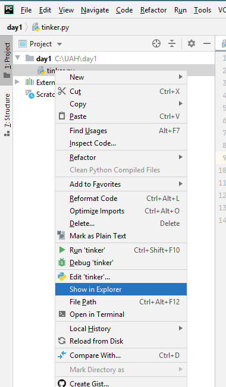

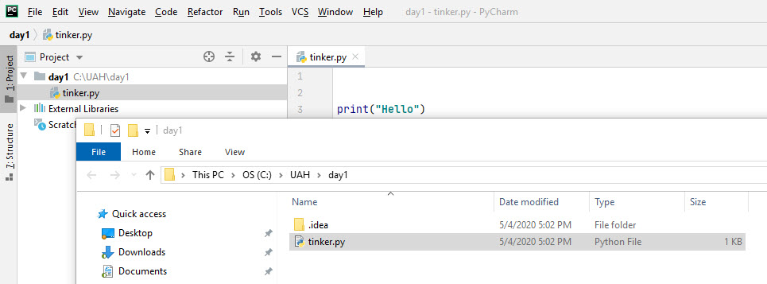

### Creating a new project

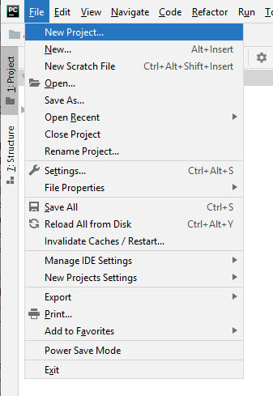

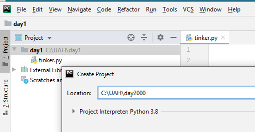

"This window" REPLACES the current project view with the new one. "New Window" opens an entirely new IDE. "Attach" adds the project to the existing tree -- just for viewing.

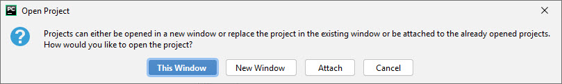

The new project has its own root directory

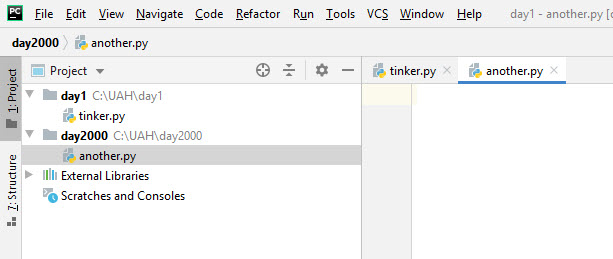
