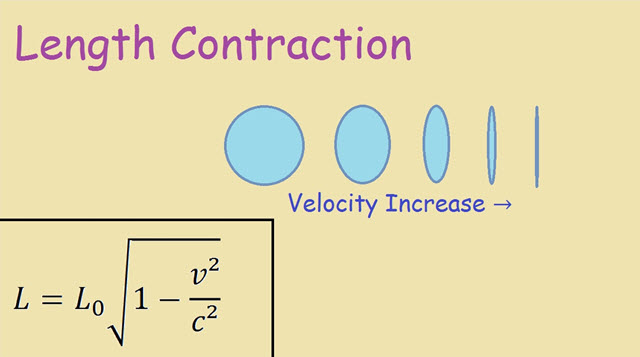

# Conversions

Use the `input` and `print` functions to prompt the user for values
and perform calculations.

## Temperature
  - Ask the user for a temperature value in F
  - Print the conversion to C
  
## Miles and Meters
  - Ask the user for a number of feet
  - Convert that to miles
  - Convert that to meters
  
## Bonus

Moving objects appear to shrink for stationary observers. How fast does
a 12 foot car need to be going to fit in a 10 foot garage?

