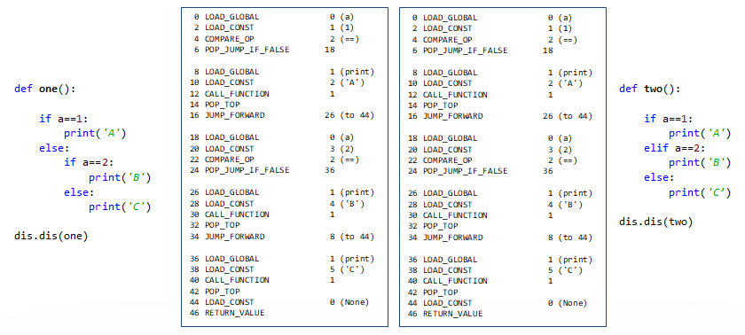

# Control Flow

## Booleans
  - True
  - False
  
https://docs.python.org/2.4/lib/truth.html

## IF/ELIF/ELSE

Introduce `pass` here.

We discussed changing straight-through flow using call/return and subroutines.

Within a function, there are two kinds of jumps ... forwards (skip over code) and backwards (repeat code).

```
print('start')
a = 7
if a==7:
  print('It is seven')
print('done')
```

### Add the else

```
print('start')
if a==5:
    print('FIVE')
else:
    print('NOT FIVE')
print('done')
```

### Nesting

```
a = 7

print('start')

if a==5:
    print('FIVE')
else:
    if a==6:
      print('SIX')
    else:
      if a==7:
         print('SEVE')
      else:
         print('OTHER')
```

This else/if is easier in languages with braces. You can pull the "else" and "if" onto one line:

```
if(a==5) {
} else if(a==6) { 
} else {
}
```

## ELIF

Python added an "elseif" to collapse the spacing. It produces the exact same code.

```
if a==5:
    print('FIVE')
elif a==6:
    print('SIX')
elif a==7:
    print('SEVE')
else:
    print('OTHER')
    
print('done')

```



## Logical expressions

```        
# if a>=1 and a<=10:

if a>5 and a<4:
    print('wow')
    
if not a>5:
    print('pass')
    
# These expressions are booleans

# Logical operators
# ==, !=, <, <=, >, >=

x = a>5 # True or False

if x:
    print('Pass')

def is_it_five_forty():
    return True    
    
if is_it_five_forty():
    print('DING DING DING')
```

## True-ness

```
# Python will asses the "true-ness" of a value
if 1:
    print('1 is True')

if not 0:
    print('0 is False')
  
s = 'j'  
if s:
    print('non-empty string is True')
    
s = ''
if not s:
    print('empty string is False')
```

## WHILE/BREAK/CONTINUE

Backwards to repeat code (loops).

The WHILE loop is the most primitive. You must initialize the loop variable
and you must change the loop variable as needed.

  - BREAK looks back up to the first loop it finds and breaks out
  - CONTINUE looks back up to the first loop it finds and continues

```
x = 0
while x<5:
    print(x)
    x += 1
```

```
x = 0
while x<5:
    print('Top')
    x += 1
    if x==3:
        continue
    print(x)
```

Don't be confused because they are in an "if". break and continue work on loops. If in a nested
loop, look back to the FIRST while you find.

```
x = 0
while x<5:
    print('Top')
    x += 1
    if x==3:
        break
    print(x)
```

## Ranges

```
for i in range(10):
    print(i)

for i in range(12,2,-3):
    print(i)
```

The "for" is not like other languages. It is NNOOTT numeric. It uses iterators and visits items in
a generated sequence. The "range" function generates a sequence that the
for then iterates over. Anything with an iterator will "for" just fine. In fact,
strings are collections. You can "for" over them.

WHILE should be faster over numerical ranges? We need to prove that!
   
``` 
for i in 'hello world':
    print(i)
```

## Recursion


```
def factiorial_by_loop(a):
    ret = a
    while a!=1:
        a = a - 1
        ret = ret * a
    return ret
    
def factorial(a):
    if a==1:
        return 1
    # else here? what's your opinion? does it affect the disassembly?
    return a*factorial(a-1)
```

Show an infinite recursion and what happens on the stack. Show the blowup.

Show the factorial example.