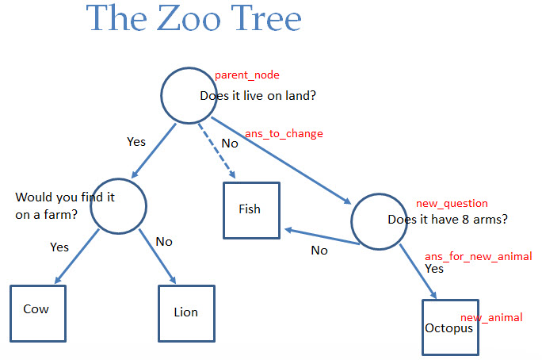

# The Zoo

Use the Zoo example from the lecture (given below). You are writing the `add_new_animal` function shown below. This
function builds a new animal node (a dictionary) from the given information and changes the zoo at the given
parent node.

Refer to the tree diagram below to identify the elements of the tree to add/change.

`zoo_problem.py`

```python
ZOO = {
    'question' : 'Does it live on land?',
    'yes' : {
        'question' : 'Does it live on a farm?',
        'no' : 'LION',
        'yes' : 'COW'
    },
    'no' : 'FISH'    
}

def add_new_animal(parent_node,ans_to_change,new_animal,new_question,ans_for_new_animal):
    # Your code here
    pass

print(ZOO)

node = ZOO # Does it live on land?
add_new_animal(node,'no','OCTOPUS','Does it have 8 arms?','yes')

print(ZOO)

node = ZOO['yes'] # Would you find it on a farm?
add_new_animal(node,'yes','CHICKEN','Do you milk it?','no')

print(ZOO)
```

The prints should look like this:

```
{'question': 'Does it live on land?', 'yes': {'question': 'Does it live on a farm?', 'no': 'LION', 'yes': 'COW'}, 'no': 'FISH'}
{'question': 'Does it live on land?', 'yes': {'question': 'Does it live on a farm?', 'no': 'LION', 'yes': 'COW'}, 'no': {'question': 'Does it have 8 arms?', 'yes': 'OCTOPUS', 'no': 'FISH'}}
{'question': 'Does it live on land?', 'yes': {'question': 'Does it live on a farm?', 'no': 'LION', 'yes': {'question': 'Do you milk it?', 'no': 'CHICKEN', 'yes': 'COW'}}, 'no': {'question': 'Does it have 8 arms?', 'yes': 'OCTOPUS', 'no': 'FISH'}}
```



