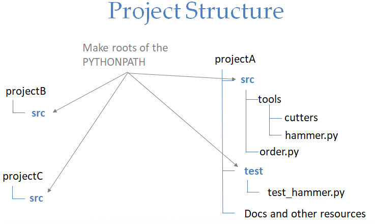

# Import is a verb

## Example directory and files

```
  order.py
  app_main.py
  >tools
    hammer.py
    >cutters
      knife.py
      saw.py
```

Replace HERE below with "saw", "knife", "hammer", etc in the py files.

```python
print('In HERE')

def HERE_things():
    print('HEREing')
```

## Basics of import

A `module` is a single python file. The `import` statement pulls all the attributes (variables, functions) into the current module.      

From the REPL:

```
>>> dir() # Look at the attributes in my module
['__annotations__', '__builtins__', '__doc__', '__loader__', '__name__', '__package__', '__spec__']
```

Now to import the "order.py" file:

```
>>> import order # Notice ... drop the ".py"
In order
>>> dir()
['__annotations__', '__builtins__', '__doc__', '__loader__', '__name__', '__package__', '__spec__', 'order']
>>>
```

Notice "order" is now in our module. Notice that the code is turned to bytecodes and RUNS.

The `order` attribute has all things in that module:

```
>>> dir(order)
['__builtins__', '__cached__', '__doc__', '__file__', '__loader__', '__name__', '__package__', '__spec__', 'order_things']
```

A bunch of "freebies" plus "order_things" functions.

```
>>> order.order_things()
Ordering things
```
   
The module is only ever compiled/run ONE time. Second imports are ignored.

```
>>> import order
>>> import order
```

## Flavors of import

### AS

The `as` lets you give the module another name in your module.

```
Restart the REPL to clear the imports.
>>> import order as wowser
In order
>>> wowser.order_things()
Ordering things
>>> import order as other
>>> import order           # Still only compiled/run one time
>>> dir()
['__annotations__', '__builtins__', '__doc__', '__loader__', '__name__', '__package__', '__spec__', 'order', 'other', 'wowser']
```

### FROM

The `from` lets you pull parts of a module into your own module.

```
Restart the REPL to clear the imports.
>>> from order import order_things
>>> order_things()
Ordering things
>>> dir()
['__annotations__', '__builtins__', '__doc__', '__loader__', '__name__', '__package__', '__spec__', 'order_things']
```

And you can use `as` to change the name:

```
Restart the REPL to clear the imports.
>>> from order import order_things as fun
>>> fun()
Ordering things
```

## Import path

Python first checks its list of built-ins, then looks for imports on the sys.path.

```
>>> import sys # This is a "built in" module
>>> print(sys.path)
['', 'C:\\Users\\tophe\\AppData\\Local\\Programs\\Python\\Python38-32\\python38.zip', 'C:\\Users\\tophe\\AppData\\Local\\Programs\\Python\\Python38-32\\DLLs', 'C:\\Users\\tophe\\AppData\\Local\\Programs\\Python\\Python38-32\\lib', 'C:\\Users\\tophe\\AppData\\Local\\Programs\\Python\\Python38-32', 'C:\\Users\\tophe\\AppData\\Roaming\\Python\\Python38\\site-packages', 'C:\\Users\\tophe\\AppData\\Local\\Programs\\Python\\Python38-32\\lib\\site-packages']
```

```
>>> import sys
>>> sys.modules # Currently imported modules
```

The `site-packages` directory is where you would "install" things (pip uses this). One for "user installs" and one for "system installs". This is where you would 
put your code when you give it give it to customers.

Notice the first entry is "". Thats the current directory. That's why we find our own files when we run them in the REPL, cmd, and IDE.

## Packages

A package is a directory of python modules and/or packages.

```
>>> import tools.cutters.knife
In knife
>>> dir()
['__annotations__', '__builtins__', '__doc__', '__loader__', '__name__', '__package__', '__spec__', 'tools']
>>>
Restart the REPL to clear the imports.
>>> from tools.cutters import knife
>>> dir(tools.cutters)
Restart the REPL to clear the imports.
>>> from tools.cutters.knife import knife_things as K
In knife
>>> dir()
['K', '__annotations__', '__builtins__', '__doc__', '__loader__', '__name__', '__package__', '__spec__']
>>>


>>> from tools.cutters import knife.knife_things
  File "<stdin>", line 1
    from tools.cutters import knife.knife_things
                                   ^
SyntaxError: invalid syntax
```

## init and main

Python two required a file named `__init__.py` to be considered a package. Python 3 dropped this requirement.

You can put code in `__init__.py` to be executed when the package loads.

The variable `__name__` lets you know if the module is the main module or being imported. If it is the main module, the
value will be `__name__`.

## pip

The python package manager ships with python. 

The executable may be in your path:

```
C:\UAH>where pip
C:\Users\tophe\AppData\Local\Programs\Python\Python38-32\Scripts\pip.exe
```

The best way to run it is as a python package:

```
py -m pip install pyperclip
```

Then you can use pyperclip to paste info FROM the clipboard or copy info TO the clipboard.

```
import pyperclip
pyperclip.copy('HELLO')

# Now paste that somewhere.
# Now copy text from anywhere to the clipboard

pyperclip.paste()
```

## Project Structure

When you run a script from the command prompt or icon, the python path is set to the directory of that script. For small tools with
only a few files, that works great.

For larger projects, think in terms of "where are these going to be installed in the deployed site-packages.

I like to have a "src" or "pysrc" or "source" or whatever directory. And tell my IDE that THIS is the start of the PYTHONPATH.

You can other entries to the python path as needed. For instance, your project might co-exist alongside others being developed.

I like to keep my test code in a separate "test" directory that I also add to the pythonpath.



