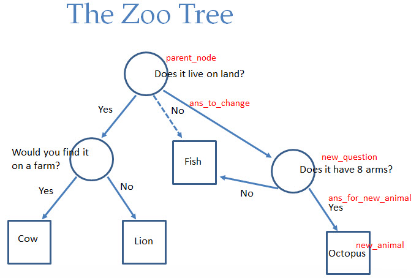

# The Zoo

Type in (or copy/paste) our Zoo example so far.

## Easy: Add some new animals to the data structure

Do you have pets? Add one of those. How about a zebra? A salamander?

## Medium: Add some error checking to the `get_yes_no` function

The function should always return exactly 'yes' or 'no'. Do you take single letters?
Is it case sensitive? How about 'YEP' and 'NOPE'?

## Hard: Collect information on the new animal

If the final guess was incorrect, ask the user for the information to add to the tree.
DON'T ADD THE DATA YET. Just ask the user:
  - What was the animal?
  - What's a question to separate the guess from the user's animal?
  - Is the answer to that question 'yes' or 'no' for the user's animal?
  
## Expert: Add the new node to the tree

Use the information you gathered to modify the tree structure with the new animal.

This diagram might help you identify the parts of the tree to change.

