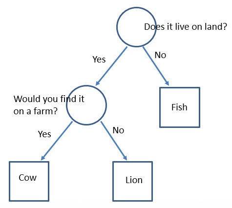

# Example: The Zoo

## Tree Structures

We've seen lists and dictionaries. Computer Science is filled with data structures to help you solve
your problems.

Graph theory, tree structures


XML and JSON describe tree structures. Very common things.

Concepts of nodes, parents, children, branches, leaves.

## The Zoo

Here is a fun application of a tree structure.



Follow the nodes down the tree to search for your animal.

We'll use a dictionary for the node:

```python

node1 = {
  'question' : 'Does it live on a farm?',
  'yes' : 'cow',
  'no' : 'lion'
}

root_node = {
  'question' : 'Does it live on land?',
  'yes' : node1,
  'no' : 'fish'  
}
```

Remember, the dictionary just maps pointers. So 'yes' points to another node where we continue. And 'no' points to a string -- the end of the line -- the guess.

Practice following the pointers:

```python
print(node1['no'])
print(root_node['no'])
print(root_node['yes']['yes'])
```


# Using the literal syntax

```python
ZOO = {
    'question' : 'Does it live on land?',
    'yes' : {
        'question' : 'Does it live on a farm?',
        'no' : 'LION',
        'yes' : 'COW'
    },
    'no' : 'FISH'    
}
```

# Adding animals

Now lets modify the tree.

`SEE snippets.pptx`


First, we create the new node:

```python
node2 = {
  'question' : 'Does it have 8 arms?',
  'no' : 'fish',
  'yes' : 'octopus'
}
```

Now replace the 'no' pointer of the root node:

```python
root_node['no'] = node2

print(root_node['no']['yes'])
```

# User interface over the tree

Let's add a user-interface to the tree. First a helper function to ask the user yes/no and return yes/no.

```python
def ask_yes_no():
   r = input('yes/no: ')
   # TODO: error checking here
   return r
```

Now the code to walk the tree:

```python
current_node = ZOO

print(current_node['question'])
ans = get_yes_no()

print(current_node[ans])
```

How can we tell if this is new node or an animal?

```python
while True:
    # Ask the question and get the answer   
    print(current_node['question'])
    ans = get_yes_no()
    
    # If the answer leads to another question, then
    # change nodes to that node and continue
    next_node = current_node[ans]
    if isinstance(next_node,dict):
        current_node = next_node
        continue
    
    print('My guess is: '+next_node)
    print('Let\'s play again!')
    current_node = ZOO
```

Use the Zoo example from the lecture (given below). You are writing the `add_new_animal` function shown below. This
function builds a new animal node (a dictionary) from the given information and changes the zoo at the given
parent node.

Refer to the tree diagram below to identify the elements of the tree to add/change.

`zoo_problem.py`

```python
ZOO = {
    'question' : 'Does it live on land?',
    'yes' : {
        'question' : 'Does it live on a farm?',
        'no' : 'LION',
        'yes' : 'COW'
    },
    'no' : 'FISH'    
}

def add_new_animal(parent_node,ans_to_change,new_animal,new_question,ans_for_new_animal):
    # Your code here
    pass

print(ZOO)

node = ZOO # Does it live on land?
add_new_animal(node,'no','OCTOPUS','Does it have 8 arms?','yes')

print(ZOO)

node = ZOO['yes'] # Would you find it on a farm?
add_new_animal(node,'yes','CHICKEN','Do you milk it?','no')

print(ZOO)
```

The prints should look like this:

```
{'question': 'Does it live on land?', 'yes': {'question': 'Does it live on a farm?', 'no': 'LION', 'yes': 'COW'}, 'no': 'FISH'}
{'question': 'Does it live on land?', 'yes': {'question': 'Does it live on a farm?', 'no': 'LION', 'yes': 'COW'}, 'no': {'question': 'Does it have 8 arms?', 'yes': 'OCTOPUS', 'no': 'FISH'}}
{'question': 'Does it live on land?', 'yes': {'question': 'Does it live on a farm?', 'no': 'LION', 'yes': {'question': 'Do you milk it?', 'no': 'CHICKEN', 'yes': 'COW'}}, 'no': {'question': 'Does it have 8 arms?', 'yes': 'OCTOPUS', 'no': 'FISH'}}
```


