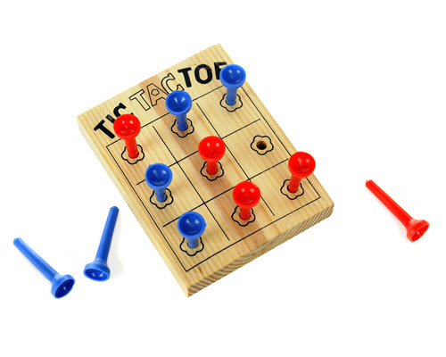

# The Tic Tac Toe board

Create the `TicTacToeBoard` class. Just the methods here ... no need to make them work! 
Have them `pass` or print something and return a dummy value.

Your class should include:
  - a constructor that takes nothing (but will do something later)
  - a "make a move" method that takes `location` (an int) and a `token` (a string) and returns nothing
  - a "get value of location" method that takes `location` (an int) and returns the token (a string) from that location
  - a "check game status" method that takes nothing and returns a string ('playing', 'tie', 'x-won', 'o-won')
  
Write some test code to make calls on a tic-tac-toe board. 

`OPTIONAL` You could even get fancy and stub
out an entire 2-player game loop. Of course, the board isn't fleshed out so the game wouldn't
be very exciting. But the "using" code could work!

  