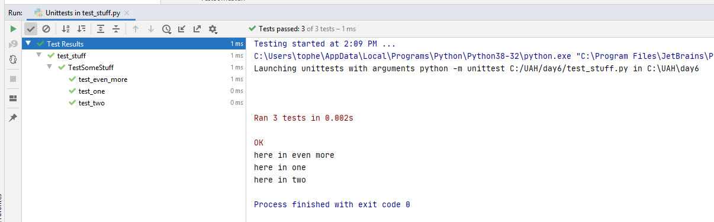

# Unit testing

Maybe not (but maybe) for your quick tools, but definitely for your applications.

Since most of the error checking in python happens at runtime, it is important to
test (by running) all aspects of your code. Unit testing is very important for
python code.

Traditionally, `unit testing` is the lowest level of testing on your code. You are
exercising the individual functions and objects. Higher levels of testing include 
"integration testing", "system testing", and "acceptance testing".

Unit tests are highly "automate-able". Your testing-code gets checked in to the code
repository along with the code it tests. These tests can be run by the developer
periodically (especially before checking in) to make sure nothing got broken.

Continuous integration servers can run these unit tests and reject merge requests to the
main line.

Continuous integration servers (like Jenkins) can perform nightly builds (and tests) and
keep graphs and statistics about how the code how improved (or broke) over time.

# Python unittest

Python has a wonderful built-in unit test framework.

```python
import unittest
```

You can run the framework's "main" method, and it will look through your python files
and packages and run all the tests it finds. Or you can specify one python file and
even one test.

Our IDEs have graphical runners that show the output nicely. We'll see that in pyhcarm.

You can configure the output of the framework to be a standard XML format that CI servers
understand.

# Basic test format

```python
import unittest

class TestSomeStuff(unittest.TestCase):
    
    def test_one(self):
        print('here in one')

    def test_two(self):
        print('here in two')

    def test_even_more(self):
        print('here in even more')
 ```
 
 If a test method reaches its end, it is assumed that it succeeded. We'll see how to
 perform the actual tests shortly.
 
```
C:\UAH\day6>py -m unittest
...
----------------------------------------------------------------------
Ran 3 tests in 0.000s

OK
```

Add some print statements.

```
C:\UAH\day6>py -m unittest
here in even more
.here in one
.here in two
.
----------------------------------------------------------------------
Ran 3 tests in 0.002s

OK
```

Notice that the order of these tests must not be important. No test should depend on another. Each test
is a stand-alone thing that can be run anytime all by itself.

Or in PyCharm:



If you are using the automatic test finder, name your files "test_" and your tests starting with "test_".

# Test assertions

In PyCharm, type "self.assert" and look at all the methods!

```python
    def test_one(self):
        self.assertTrue(1==1)
        self.assertFalse('hello'=='world')
        self.assertTrue(1==2,'I am here')
```

Look at this from both the command line and pycharm.

## Dictionary checks

```python
   def test_two(self):
        d1 = {'name': 'chris', 'cool': True}
        d2 = {'cool': True, 'name': 'Chris'}

        self.assertDictEqual(d1,d2)
```

```
AssertionError: {'name': 'chris', 'cool': True} != {'cool': True, 'name': 'Chris'}
- {'cool': True, 'name': 'chris'}
?                         ^

+ {'cool': True, 'name': 'Chris'}
? 
```

# Setup and Teardown

```python
class TestSomeStuff(unittest.TestCase):
    
    def setUp(self):
        print('IN SETUP')
        self.data = {'name' : 'chris', 'cool' : True}
        
    def tearDown(self):
        print('IN TEARDOWN')
    
    def test_one(self):
        print('here in one')
    
    def test_two(self):
        print('here in two')
        n = self.data['name']
        print('I see name is',n)
    
    def test_even_more(self):
        print('here in even more')
```

```
Finding files... done.
Importing test modules ... done.

IN SETUP
here in even more
IN TEARDOWN
IN SETUP
here in one
IN TEARDOWN
IN SETUP
here in two
I see name is chris
IN TEARDOWN
----------------------------------------------------------------------
Ran 3 tests in 0.001s

OK
```

# An Example

Test-driven-development. We write the tests before the actual code. Well, except for the API.
The API should come first.

`robot.py`

```python
class Robot:
    
    def __init__(self,name):
        pass
    
    def get_name(self):
        pass  
        
    def move_to(self,x,y):
        pass
    
    def fire_laser(self,power):
        pass
``` 

`test_robot.py`

```python
import unittest

from robot import Robot

class TestRobot(unittest.TestCase):
    
    def test_testing(self):
        pass
    
    def test_robot_name(self):
        rob = Robot('R2D2')
        n = rob.get_name()
        self.assertTrue(n=='R2D2')
```

```
======================================================================
FAIL: test_robot_name (test_robot.TestRobot)
----------------------------------------------------------------------
Traceback (most recent call last):
  File "D:/git/class-IntroPython/Topics/12_UnitTests\test_robot.py", line 13, in test_robot_name
    self.assertTrue(n=='R2D2')
AssertionError: False is not true

----------------------------------------------------------------------
```

Now go fix the code to pass the case.

```python
class Robot:
    
    def __init__(self,name):
        self.my_name = name
    
    def get_name(self):
        return self.my_name
```

Now others:
  - move to between (0,0) and (10,10)
  - laser between 0 and 100%
  - safety feature ... can't fire laser at (0,0) (home)
 